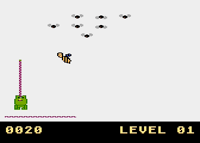

# Frog

A simple game for Atari XL/XE. You need to eat as many flies as you can.
Beware of the wasp!



## Usage

Use Altirra or other emulator and load [frog.xex](bin/frog.xex) file.

## Building

The project can be assembled with [MADS](https://mads.atari8.info/):

```sh
mads src/main.asm -o:bin/frog.xex
```

## Tools

* [Altirra](https://www.virtualdub.org/altirra.html)
* [MADS](https://mads.atari8.info/)
* [Chaos Music Cross Composer](https://sourceforge.net/projects/cmx-atari/)
* [Atari FontMaker](http://matosimi.websupport.sk/atari/atari-fontmaker/)